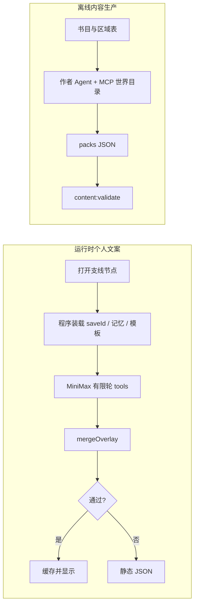

# 江湖长夜：P1 之后的 Agent 工作流、输入输出、MCP 与 Tools

> 2026-09-08 现行约定（随 `a9cebf2` 后的官方入口修复落地）。国内 OpenAI 兼容入口 `https://api.minimax.cn/v1`，默认 `MiniMax-M2.5-highspeed`，`reasoning_split` 把思考放到 `reasoning_details`。  
> 不替代 `07` 文案铁律与 `11` 阶段边界。AGENTS.md 5.7 为总览摘要。

## 一、为何要从「一次补全」升级为 Agent

第一步已经把 MiniMax 接到 `POST /api/narrative/node`：密钥只在服务端，程序决定事实与奖励，模型只改写允许字段。线上实测问题是：思考内容进了 `content`/`reasoning_details`，解析失败就整段回退静态 JSON，玩家看到的仍是离线文案。

继续把记忆、模板、校验全塞进一条 prompt，无法审计、无法复用、也无法扩到原著树与客栈传闻。第二步按 Agent 开发步骤拆开：**契约 → 工具 → MCP 边界 → 确定状态机 workflow → 校验回退 → 观测**。

运行时 Agent 不是聊天机器人，也不是开发者用的 Grok workflow。它是 Node 进程里「有限轮 tool loop + 程序终裁」的文案改写器。

## 二、Agent 开发步骤（本项目）

| 步骤 | 产出 | 状态 |
|---|---|---|
| 1. 字段契约 | 允许改写 / 禁止改写表，`extractTemplate` / `mergeOverlay` | **已落地**；缺字段用模板补 |
| 2. 单次补全打通 | 官方 `api.minimax.cn`、`reasoning_details`、失败回退 | **已落地**（SIDE_EVENTS） |
| 3. In-process tools | 模型可查询记忆与模板，不可发奖 | 设计完成，未实现循环 |
| 4. 确定 workflow | 装载 → 改写 → 合并 → 缓存 | **已落地**（单次补全，尚未多轮 tool） |
| 5. MCP（非热路径） | 世界目录与记忆只读 | 设计完成，未建 server |
| 6. 观测 | health 含 `llm` / `model` / `base` / `store`；失败带内容预览 | **已落地** |
| 7. 扩展面 | 先 SIDE_EVENTS，再客栈传闻，最后原著树 | SIDE_EVENTS 已开；其余禁止一次全开 |

## 三、两条工作流，不要合成一个 Agent



运行时追求低延迟、可回退、不改规则。离线生产追求完整 packs、校验与人工过目。两者共享五模块字段，**不共享同一个 tool 列表**。

### 3.1 运行时 workflow（热路径）

1. 校验 `saveId`、`eventId`、`nodeId`。
2. 程序读取记忆文档与节点模板（权威，不经模型）。
3. 命中 `generated_nodes` 缓存则直接返回。
4. 否则调用 MiniMax：`POST https://api.minimax.cn/v1/chat/completions`，`reasoning_split: true`，`max_completion_tokens`。
5. 从 `message.content` 取 JSON；若空再扫 `reasoning_details[].text`。
6. `mergeOverlay`：选项 id / next / combat / effects 以模板为准；字面缺失则保留模板。
7. 写入缓存。失败则 `source: template`，游戏不中断。

上限：单节点 1 次生成（后续再加最多 3 轮 tool）。超时与 HTTP 错误一律回退。

### 3.2 离线作者 workflow（冷路径）

输入：书名、区域、设施皮肤、禁止奖励表。  
输出：可 `content:validate` 的 pack JSON。  
MCP 提供只读世界目录与校验器。模型不得直接改 `src/content/packs/`；由人运行 `content:index`。

## 四、输入 / 输出

### 4.1 运行时权威输入（程序提供，模型不可改）

| 字段 | 来源 | 作用 |
|---|---|---|
| `saveId` | 存档 UUID | 隔离记忆与缓存 |
| `eventId` / `nodeId` | `SIDE_EVENTS` | 定位模板 |
| `template.scene/dialogues/hearsay/choices[].id` | 内容包 | 骨架 |
| `choices[].next/failNext/combat/cost/effects` | 内容包 | 规则，永不进模型输出 |
| `facts` / `journal` / `npcs` | `p0` | 记忆材料 |

### 4.2 模型可见上下文

名号、区域、记忆摘要、近事 12 条、NPC 印象。禁止把完整存档或战斗种子交给模型。

### 4.3 允许输出

```json
{
  "scene": "string",
  "dialogues": [["说话人", "台词"]],
  "hearsay": "string",
  "choices": {
    "accept": { "text": "string", "outcome": "string", "failText": "string" }
  }
}
```

对白条数以模板为准：多的丢掉，少的用模板补。选项只接受模板已有 id。

### 4.4 禁止输出

奖励、死生、武学秘籍、神兵、`next` / `failNext`、新选项、把玩家写成段誉/乔峰/韦小宝等原著主角。

## 五、MCP 还是 Tools

判定：

- **Tools**：与当前 HTTP 请求同生死、必须同步、结果要进 merge。实现为进程内 function calling。
- **MCP**：跨进程、可被编辑器/作者 Agent/未来多端复用的权威数据。**不**放在打开节点的热路径上，避免多一跳超时。
- **都不是**：条件、效果、战斗、存档写入。没有 `grant_silver`、`kill_npc` 这类 tool。

### 5.1 第一期运行时 tools（in-process）

| name | 参数 | 返回 | 实现 |
|---|---|---|---|
| `get_memory` | `saveId` | 记忆摘要与事实列表 | `buildMemoryDocument` / store |
| `get_event_template` | `eventId`, `nodeId` | 已剥离规则的模板 | `extractTemplate` |
| `list_allowed_choice_ids` | `eventId`, `nodeId` | 选项 id 数组 | 模板 |
| `validate_overlay` | overlay JSON | `{ok, errors}` | `mergeOverlay` 的错误版 |

第一期也可以先不让模型调 tool，由程序把这四项塞进 prompt（现状）。上 tool loop 后，模型只允许调用上表。

### 5.2 MCP（冷路径，第二期）

| server | 暴露 | 消费者 |
|---|---|---|
| `jianghu-world` | 只读资源：区域、房间、SIDE_EVENTS 目录、禁止奖励表 | 作者 Agent、编辑器 |
| `jianghu-memory` | 按 `saveId` 读记忆，禁止跨档 | 调试台、多端只读 |
| `jianghu-validate` | `validateP0` 包装 | CI 与作者 Agent |

MiniMax 官方 MCP（语音/视频/音乐）**不**接入运行时文案。配音仍走现有离线 `generate-voice.mjs`。

### 5.3 明确不做的 tool

`apply_effects`、`start_combat`、`set_fact`、`complete_quest`、`give_item`。这些只存在于 `world-rules.js` / `side-events.js`。

## 六、MiniMax 接入约定

依据 [OpenAI 兼容文档](https://platform.minimaxi.com/docs/api-reference/text-openai-api)：

```text
POST https://api.minimax.cn/v1/chat/completions
Authorization: Bearer <Key.txt 中的 MINIMAX_API_KEY>
model: MiniMax-M2.5-highspeed
reasoning_split: true
max_completion_tokens: 2200
```

- Token Plan 的 `sk-cp-` 走国内站；国际站 `api.minimax.io` 会报 invalid api key。
- M2.x **不能关闭 thinking**。必须读 `content`，并用 `reasoning_details` 作后备解析。
- `temperature` 合法区间 [0, 2]。
- 密钥只在 `Key.txt` / `JIANGHU_KEY_PATH`，永不进前端与 MCP 资源正文。

实现文件：`server/minimax.mjs`、`server/narrative.mjs`、`server/index.mjs`。

## 七、界面与回退

`CityHub` 在 `source` 为 `generated` 或 `cache` 时显示「此番见闻因人而异」。原著任务树弹窗仍走固定剧本，未接入本 Agent。断网、超时、解析失败显示静态 JSON，不弹错误挡操作。

## 八、安全、观测、发布

- 威胁：提示词注入试图加奖励 → merge 丢弃未知字段；密钥泄漏 → gitignore + 仅 127.0.0.1:8083。
- 观测：`GET /api/health` 返回 `llm`、`model`、`base`、`store`；失败日志带内容预览、不带密钥。
- 延迟目标：highspeed 生成 P95 < 12s；nginx `proxy_read_timeout` 45s。
- 回滚：`JIANGHU_LLM=0` 或停 API 进程，前端自动静态文案。

## 九、Key Decisions

1. **程序终裁，模型只写字面。** 避免 LLM 改变江湖规则。
2. **热路径不用 MCP。** 打开节点多一跳会放大超时，已发生过 nginx 20s 切断。
3. **国内 `api.minimax.cn` + highspeed。** 与官方 OpenAI 示例一致，并降低思考超时。
4. **合并放宽、解析收紧。** 缺选项用模板补，而不是整段作废；JSON 必须能解析。
5. **运行时与作者 Agent 分开。** 避免内容生产的长上下文污染对局。

## 十、Alternatives

| 方案 | 优点 | 缺点 | 结论 |
|---|---|---|---|
| 继续单次超长 prompt | 实现简单 | 无法审计、易解析失败 | 第一步可，第二步不够 |
| 热路径 MCP | 与编辑器统一 | 延迟与运维成本 | 否 |
| 把规则做成 tool 让模型发奖 | 看起来更像 Agent | 违反铁律 | 否 |
| 直接上 MiniMax-M3 | 上下文更大 | 非当前已验证套餐默认 | 可配置，不作为默认 |

## 十一、PR Plan

1. **对齐官方 Chat Completions**：`server/minimax.mjs` 改 `api.minimax.cn`、`reasoning_details`、`max_completion_tokens`、highspeed。
2. **放宽 mergeOverlay**：缺对白/选项时保留模板；CityHub 标明因人而异。
3. **In-process tools 循环**（可选后续）：最多 3 轮，仅第五节工具。
4. **MCP 世界目录**（冷路径）：只读 packs/区域，供作者 Agent。
5. **原著树节点覆盖**：复用同一 overlay 契约，一棵树一棵接。

## 十二、Open Questions

- 默认模型维持 M2.5-highspeed，或改 M3（需确认 Token Plan 额度）。
- 客栈打听是否第二批接入（现为 `INN_VOICES` 轮换）。

## 十三、References

- https://platform.minimaxi.com/docs/api-reference/api-overview
- https://platform.minimaxi.com/docs/api-reference/text-openai-api
- `docs/gdd/07-dialogue-framework.md`、`11-idle-rpg-roadmap.md`
- `server/minimax.mjs`、`src/game/narrative-overlay.js`
